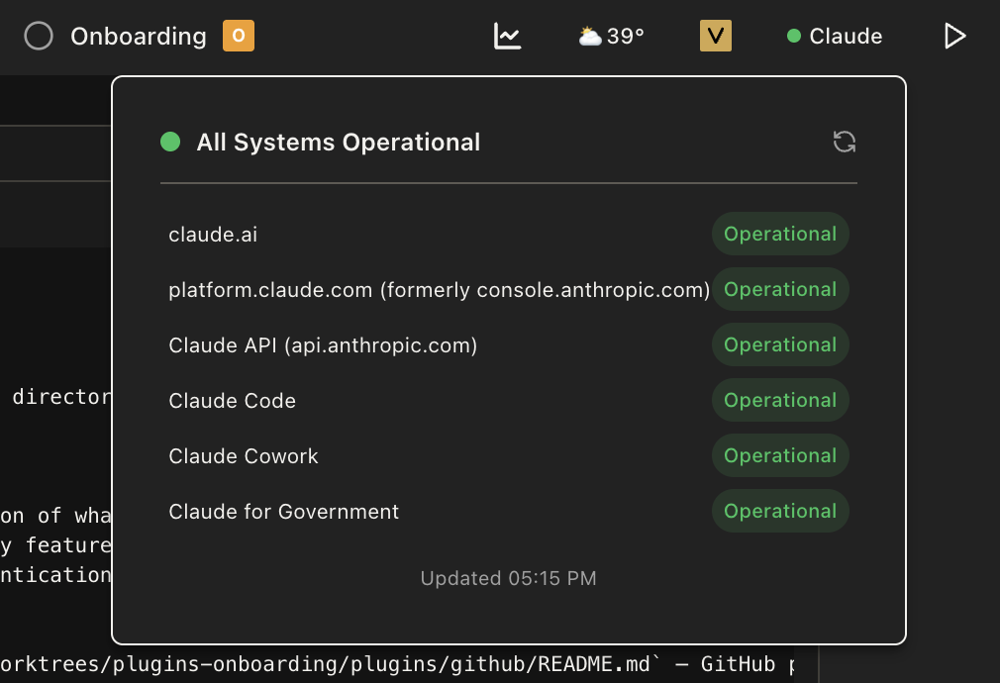

# Claude Status — Vienna Plugin



A [Vienna](https://tryvienna.dev) plugin that shows Claude's API status directly in your menu bar. Click the indicator to see a full breakdown of service components and any active incidents, all pulled live from [status.anthropic.com](https://status.anthropic.com).

## What it does

- **Menu bar indicator** — a colored dot next to "Claude" reflects the current overall status at a glance
- **Status popover** — click the menu bar item to see a per-component breakdown (API, Claude.ai, etc.) and any active incidents
- **Drawer view** — open the sidebar drawer for the full status breakdown
- **Auto-refresh** — status is polled every 60 seconds; hit the refresh button to update immediately

### Status colors

| Color | Meaning |
|-------|---------|
| Green | All systems operational |
| Amber | Minor incident |
| Orange | Major incident |
| Red | Critical outage |

## Installation

### Via vcli (recommended)

```sh
vcli scaffold --name claude-status --auto-load
```

### Manual

1. Clone this repo into your Vienna plugins directory
2. Run `pnpm install` (or `npm install`)
3. In Vienna, open Settings → Plugins → Load local plugin and point it at this directory

## Requirements

- [Vienna](https://tryvienna.dev) desktop app
- Node.js ≥ 22

## Development

```sh
pnpm install
pnpm typecheck
```

The plugin uses `hostApi.fetch()` to proxy requests through the Vienna main process, which avoids renderer CSP restrictions. The allowed domain (`status.anthropic.com`) is declared in `src/index.ts`.

## License

Apache-2.0
